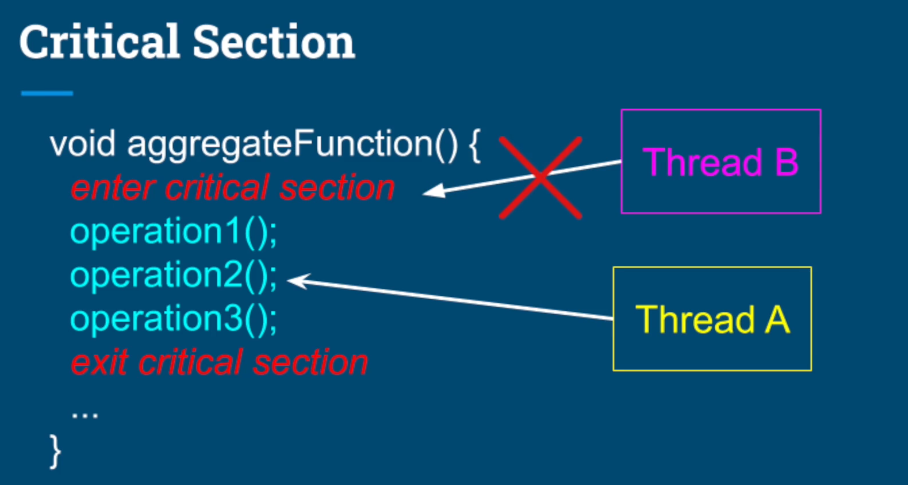

### 임계 영역과 동기화



---

### 임계 영역(Critical Section)

1. **정의**: 여러 스레드가 동시에 공유 자원에 접근하여 데이터를 수정하거나 삭제할 때 발생할 수 있는 문제를 해결하기 위한 개념입니다.
2. 여러 스레드가 동시에 자원에 접근하여 충돌하는 상황을 **경쟁 상태(Race Condition)**라고 하며, 이를 방지하기 위해 **동기화(Synchronization)** 기법이 필요합니다.

---

### 임계 영역과 경쟁 상태

#### 1. **임계 영역(Critical Section)**

- 임계 영역은 공유 자원에 접근하고 수정할 수 있는 코드의 영역을 말합니다. 여러 스레드가 동시에 이 영역에 진입하면 서로의 작업을 방해하거나 예기치 않은 결과를 초래할 수 있습니다.
- 예시: 두 스레드가 동일한 변수나 객체를 동시에 읽고 수정할 때 문제가 발생할 수 있습니다.

#### 2. **경쟁 상태(Race Condition)**

- 경쟁 상태는 여러 스레드가 동시에 자원에 접근하여 데이터를 변경하려 할 때 발생하는 문제입니다. 이때 각 스레드가 자원을 처리하는 순서나 타이밍에 따라 결과가 달라져 예상치 못한 오류가 발생할 수 있습니다.
- 예시: 스레드 A가 자원에서 값을 읽고 수정하려고 할 때, 스레드 B가 같은 자원에 접근하여 수정하면 두 스레드가 서로의 작업을 덮어쓰게 되어 잘못된 결과가 나옵니다.

#### 3. **경쟁 상태 발생 예시**

- 예시: 두 스레드가 재고 수량을 관리하는 시스템에서 동시에 재고를 증가시키고 감소시키는 작업을 한다고 가정해봅시다.
  - **스레드 A**는 재고 수량을 100에서 101로 증가시키고,
  - **스레드 B**는 같은 재고 수량을 100에서 99로 감소시키는 작업을 합니다.
- 만약 두 스레드가 동시에 작업을 하면 재고 수량이 예상한 대로 동기화되지 않고 잘못된 값을 반환할 수 있습니다.

#### 4. **동기화(Synchronization)로 해결**

- **동기화**는 여러 스레드가 임계 영역에 동시에 접근하지 못하도록 서로 다른 스레드가 자원에 접근하는 순서를 제어하는 기법입니다.
- **동기화 방법**:
  - `synchronized` 키워드를 사용하여 임계 영역을 설정하거나,
  - `Lock` 인터페이스를 사용하여 자원에 대한 독점 접근을 보장할 수 있습니다.
- 이렇게 하면 한 스레드가 작업을 끝낸 후에 다른 스레드가 자원을 수정할 수 있도록 하여 **경쟁 상태를 방지**할 수 있습니다.

---

### 임계 영역과 동기화 예시 코드

```java
public class Counter {
    private int count = 0;

    // 동기화된 메서드
    public synchronized void increment() {
        count++;
    }

    // 동기화된 메서드
    public synchronized void decrement() {
        count--;
    }

    // 동기화된 메서드
    public synchronized int getCount() {
        return count;
    }
}
```

- 위 코드에서 increment(), decrement(), getCount() 메서드는 모두 동기화되어 있습니다. 이로 인해 하나의 스레드만 메서드 내에서 자원에 접근할 수 있습니다.
- 동기화를 통해 경쟁 상태를 방지하고, 여러 스레드가 동시에 자원을 수정하는 문제를 해결할 수 있습니다.
