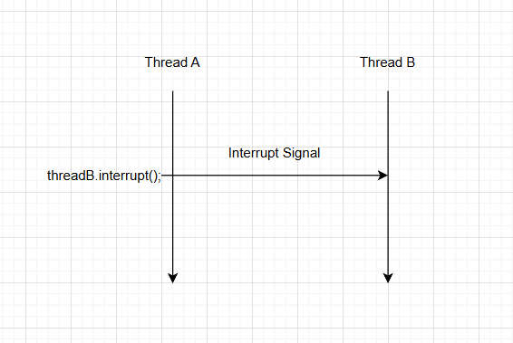

#### 스레드 조정

- 왜, 그리고 언제 스레드를 멈춰야 할까?

  - 스레드는 리소스를 사용한다 아무것도 하지 않을 떄도!

    - 메모리와 커널 자원 사용

    - CPU 와 캐쉬 메모리 사용

- 만약에 쓰레드가 완료되어도 어플리케이션이 아직 실행 중이면 , 스레드 자원을 클린해야한다.

- 만약에 쓰레드가 오작동하면 중지해야 한다.

  - 잘못된 요청을 계속 보내고 있는경우

  - 허용한 시간보다 오래전송하고 있는 경우

- 애플리케이션이 끝나더라도 스레드는 계속 동작중임 그래서 모든 스레드를 중단할 기능이 필요

---

#### Thread.interrupt()



1. InterruptedException으로 처리하는 방법

```


public static void main(String[] args) {

    Thread thread = new Thread(new BlockingTask());

    thread.start();

    thread.interrupt();

}

private static class BlockingTask implements Runnable {


    @Override
    public void run() {

        try {
            Thread.sleep(50000);
        } catch (InterruptedException e) {
            System.out.println("블록킹 쓰레드 나옴");
        }

    }
}

```

- Thread.sleep() 메서드로 블록 상태(대기 상태)에 있는 쓰레드를 중단

- InterruptedException이 발생하며 이를 잡아내고 처리합니다.

---

2. 인터럽트하려는 스레드가 신호를 명시적으로 처리하는 방법

```


public static void main(String[] args) {

    Thread thread = new Thread(new LongComputationTask(new BigInteger("20000"), new BigInteger("100000000")));

    thread.start();
    thread.interrupt();

}

private static class LongComputationTask implements Runnable {

    private BigInteger base;
    private BigInteger power;

    public LongComputationTask(BigInteger base, BigInteger power) {
        this.base = base;
        this.power = power;
    }

    @Override
    public void run() {
        System.out.println(base + "^" + power + " = " + pow(base, power));
    }

    private BigInteger pow(BigInteger base, BigInteger power) {

        BigInteger result = BigInteger.ONE;

        for (BigInteger i = BigInteger.ZERO; i.compareTo(power) != 0; i = i.add(BigInteger.ONE)) {

            if (Thread.currentThread().isInterrupted()) {

                System.out.println("Interrupted");
                return BigInteger.ZERO;

            }
            result = result.multiply(base);
        }
        return result;
    }

}


```

- 긴 연산 작업(LongComputationTask) 중간에 interrupt() 호출로 중단 여부를 확인하는 코드

- isInterrupted() 메서드를 활용하여 중단 플래그를 확인

---

#### Daemon Threads

- 데몬 쓰레드(Daemon Thread)는 자바에서 백그라운드에서 실행되며, JVM의 메인 쓰레드가 종료되면 함께 종료되는 쓰레드.

- 데몬 쓰레드는 일반적으로 응용 프로그램의 주요 작업을 지원하거나 보조 작업을 수행하는 데 사용

- 주요 특징

  - JVM 종료 시 종료

  - 데몬 쓰레드는 JVM이 종료되면 자동으로 중단.

  - 일반 쓰레드는 JVM이 종료될 때까지 계속 실행되지만, 데몬 쓰레드는 더 이상 실행 중인 일반 쓰레드가 없을 때 자동 종료.

  - 백그라운드 작업에 적합

  - 예: 가비지 컬렉터(Garbage Collector), 로그 작성기, 파일 모니터링, 타이머 작업 등.

  - setDaemon(true)로 설정

  - 쓰레드를 데몬으로 설정하려면 쓰레드 시작 전에 setDaemon(true)를 호출.

  - 이미 시작된 쓰레드에는 설정할 수 없다.

- 일반 쓰레드와의 차이

  - 일반 쓰레드(Normal Thread): 모든 작업을 완료해야 JVM이 종료.

  - 데몬 쓰레드(Daemon Thread): 메인 쓰레드가 종료되면 남아 있는 작업과 상관없이 종료.

---

#### 스레드 연결

- 쓰레드 연결이 왜 필요한가?

  - 다른 스레드는 서로 다른 스레들과 독립적으로 실행된다.

  - 실행순서는 항상 같지 않음

    - 스레드 A가 먼저 작업을 완료 할수도 있고

    - 혹은 둘이 동시에 실행되거나 병렬로 실행될수 도 있다.

---

#### A 스레드가 B 스레드에 의존적 이라면?

- 예를 들어 스레드 A의 계산값이 스레드 B에 입력된다면?

  - 스레드 B는 스레드 A가 이미 작업을 완료했는지 어떻게 알까?

    - 스레드 B가 루프를 사용해서 스레드A가 결과 값이 있는지 확인 하면 된다.

- 옳은 방법이긴 하지만 비효율적이다.

  - 루프를 사용해서 계속해서 체크를 하는것은 CPU 싸이클을 무분별하게 사용중이기 떄문

  - 차라리 쓰레드 B를 잠재우고 쓰레드 A가 모두 작업을 끝낼때 까지 대기 하였다가 깨우는것이 좋은 방법

  - 이방법이 join() 방식이다.
