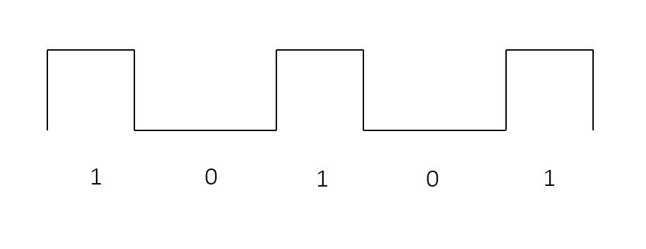

#### 물리계층의 역할

- 물리 계층이란

  - 컴퓨터들을 물리적으로 연결하거나 데이터를 전기 신호로 변환하고 제어하는 역할을 담당

    - 전기신호란?

      - 전압의 변화에 의한 신호

        - 아날로그 신호 -> 물결모양

        - 디지털 신호 -> 특정 값을 기준으로 불연속적으로 변하는 막대 모양

---

#### 디지털 신호에서 0 과 1 표현

- 주로 디지털 신호를 사용

  - 물리 계층은 비트 데이터를 사용

    - 비트란

      - 컴퓨터가 데이터를 처리하는 최소 단위 0 과 1로 구성

---

#### 송신 과정

- 송신자가 순자에게 파일 요청

- 문장을 0과 1의 비트로 변환

- 해당 비트를 전기 신호로 변환 후

- 수신자에게 전달

- 수신자 측에서는 전기 신호가 다시 0과 1의 비트로 변환

---

#### 메세지는 어떻게 그리고 어디서 전기 신호로 변환 되는껄까?

- 랜 카드는 내 컴퓨터와 인터넷을 연결하는 필수 장치

- 랜 카드에는 랜 케이블을 연결할 수있는 구명(렌 포트)가 존재

---

#### 케이블의역할

- 렌 카드가 0과 1의 비트를 전기 신호로 변환하는 역할이라면

- 케이블은 그 신호를 전달하는 역할

  - 즉 케이블은 컴퓨터, 서버, 라우터 및 다른 네트워크 장치 간에 데이터 신호를 전달하는 역할

---

#### 리피터와 허브가 통신하는 방법

- 리피터는 전기 신호를 증학는 기능을 가진 네트워크 장치

  - 전기 신호르 전송할 떄 거리가 멀어지면 신호가 감쇠 하는 성질 이 있는데 감쇠된 신호를 재생하여 전달하는 장치가 리피터

- 허브는 리피터의 확장 버전

  - 전송되는 데이터 신호를 정형하고 증폭하여 왜곡을 보정, 하나의 입력 신호를 여러 디바이스로 복제하여 데이터 분배 및 네트워크 학장을 지원

- 리피터가 일대일 통신만 가능하다면 허브는 포트를 여러 개 가지고 있기 때문에 여러 대의 컴퓨터와 연결할 수 있다.

---

#### 용어 정리

- 전기 신호 : 전기 신호는 전압이 일정한 패턴으로 변하여 생기는 일련의 흐름

- 랜 카드 : 네트워크 환경에 내 컴퓨터와 인터넷을 연결하는 필수 장치

- 케이블 : 보호 외피나 외장 안에 2개 이상의 전선이나, 광섬유로 묶여 있는 선

- 리피터 : 리피터는 전기 신호를 정형하고 증폭하는 기능을 가진 네트워크 장비

- 허브 : 리퍼터와 하는 역할을 같지만 하나의 입력 신호로 여러 디바이스에 복제하여 데이터를 전달
