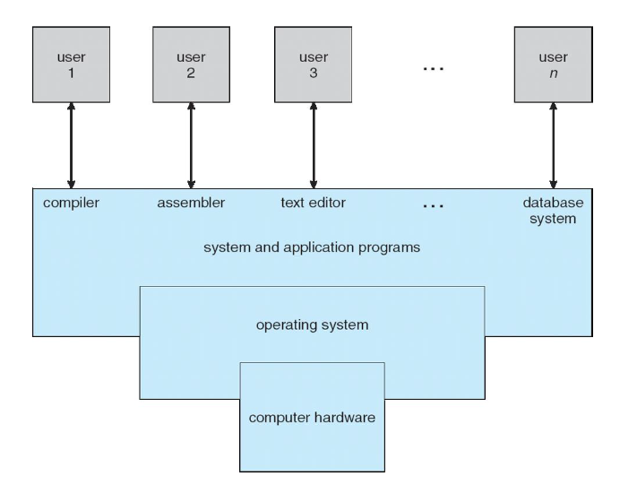
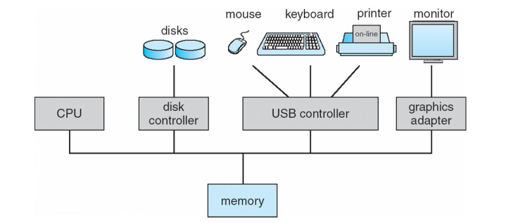
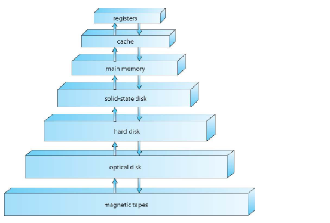
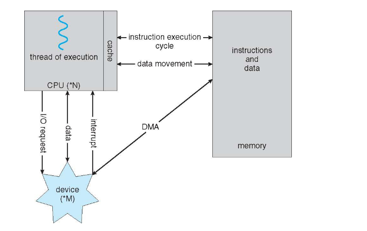
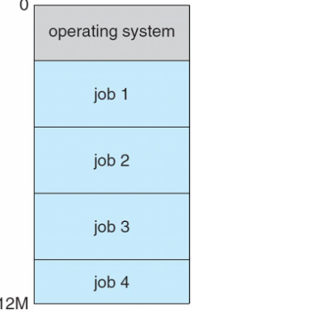
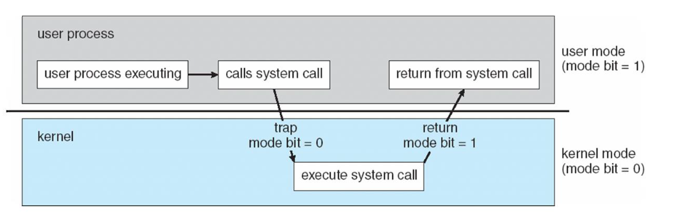
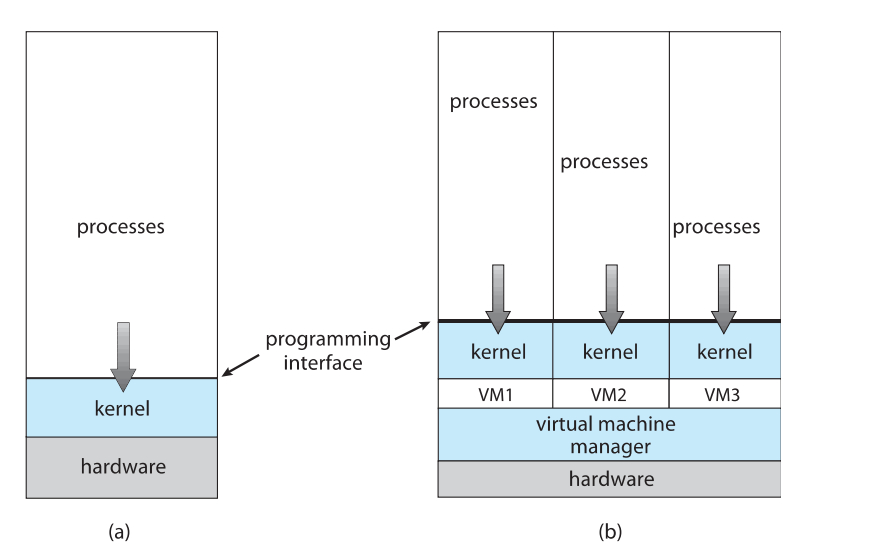
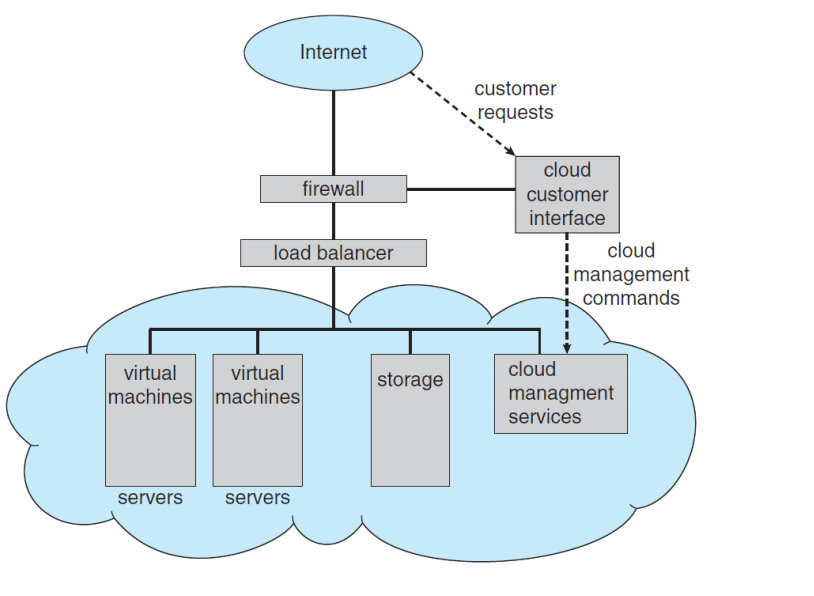

#### 1.운영체제란 무엇인가?

예제: 피자 배달 가게

운영체제는 피자 배달 가게의 매니저 역할을 한다.

- 손님(사용자)이 "페퍼로니 피자"를 주문(요청)하면, 매니저는 주방장(하드웨어)에게 주문을 전달합니다.

- 주방장은 피자를 만들고 매니저를 통해 손님에게 전달합니다.

정리:

운영체제는 사용자와 하드웨어 사이에서 중간다리 역할을 하며, 사용자가 요청한 서비스를 하드웨어로부터 실행하여 제공하는 소프트웨어

---

#### 컴퓨터 시스템 구성

예제: 자동차의 내부

- CPU(중앙처리장치): 자동차의 엔진으로, 모든 일을 실행합니다.
- 메모리: 자동차의 연료탱크로, 임시로 작업을 저장합니다.

- 하드디스크: 자동차의 트렁크로, 장기적으로 데이터를 저장합니다.

- 버스(Bus): 자동차의 배선으로, 부품 간의 데이터를 연결하고 전달합니다.

정리:

컴퓨터 시스템은 여러 구성 요소(CPU, 메모리 등)가 버스를 통해 연결되어 데이터를 주고받으며 작동합니다.

#### 3. 부팅(bootstrap 프로그램)

예제: 휴대폰 켜기

- 휴대폰 전원을 누르면, **작은 초기 프로그램(bootstrap)**이 실행됩니다.

- 이 프로그램은 **운영체제(OS)**를 메모리에 올립니다.

- 휴대폰이 켜지고 사용할 준비가 됩니다.

정리:

bootstrap 프로그램은 운영체제를 실행시키는 첫 번째 프로그램입니다.

#### 4. 인터럽트(Interrupt)

예제: 수업 중 손들기

- 선생님(CPU)이 수업을 진행 중인데, 학생(하드웨어)이 "질문이 있어요!"라며 손(인터럽트)을 듭니다.

- 선생님은 수업을 잠시 멈추고, 학생의 질문을 듣습니다.

정리:

인터럽트는 하드웨어가 CPU에게 즉각적인 처리를 요청하는 신호입니다.

#### 5. 폰 노이만 구조

예제: 요리책 보고 요리하기

- 요리사가 요리책(메모리)에서 요리법(명령어)을 읽어옵니다.

- 필요한 재료(데이터)를 준비합니다.

- 요리법에 따라 요리를 완성하고, 결과물을 접시에 담습니다.

정리:
폰 노이만 구조는 메모리에 저장된 명령어와 데이터를 순서대로 가져와 처리하는 방식입니다.

#### 6. 저장장치 계층

저장 시스템(storage systems)들은 다음과 같은 기준으로 계층적으로 구성될 수 있습니다.

- 용량(storage capacity)

- 접근 속도(access time)

예제: 옷장과 바지 주머니

- CPU 레지스터: 바지 주머니처럼 빠르지만 작은 저장공간입니다. 자주 사용하는 키를 넣어둡니다.

- RAM: 책상처럼, 당장 필요한 물건들을 꺼내 놓습니다.

- HDD/SSD: 옷장처럼, 많은 양의 데이터를 저장하지만 꺼내는 데 시간이 걸립니다.

정리:

저장장치는 속도와 용량 간의 **트레이드오프(교환관계)**로 구성됩니다.

#### 7.입출력 구조(I/O Structure)

예제: 도서관에서 책 대출하기

1. CPU(직원)은 디바이스(책)에게 대출 요청을 받습니다.

   - 사용자는 책을 대출하고 싶어하고, 직원은 이를 처리합니다.

2. 직원은 **시스템(컴퓨터)**에 접속하여 책의 대출 가능 여부를 확인합니다.

   - 책의 정보는 시스템에 저장되어 있어, 직원은 이 정보에 접근해 대출 여부를 파악합니다.

3. 책이 이미 대출 중이라면, **시스템(운영체제)**은 **인터럽트(알림)**을 통해 직원에게 대출 불가 상태를 알려줍니다.

   - 시스템이 알림을 보내면, 직원은 다른 책을 대출할 수 있게 됩니다.

4. 책이 대출 가능하다면, **시스템(메모리)**은 대출 정보를 기록하고, DMA를 통해 하드웨어(책)가 시스템에 정보를 직접 업데이트합니다.

- 대출 정보는 자동으로 기록되어 효율적으로 처리됩니다.

5. 직원은 대출이 완료된 책을 사용자에게 전달하고, 시스템에 대출 기록을 저장한 뒤, 다음 대출 요청을 처리합니다.

   - 이 과정에서 CPU는 디바이스와 시스템을 통해 정보를 주고받으며, 효율적인 입출력 작업을 처리합니다.

#### 8.멀티프로그래밍과 멀티태스킹

예제: 요리하기

- 멀티프로그래밍: 여러 가지 요리를 동시에 준비합니다. 예를 들어, 물을 끓이는 동안 샐러드를 준비합니다.

- 멀티태스킹: 모든 요리가 동시에 완성되는 것처럼 보이게끔 빠르게 돌아가며 진행합니다.(CPU 스케쥴링)

정리:

멀티프로그래밍은 CPU 효율을 극대화하고, 멀티태스킹은 사용자 경험을 부드럽게 만들어줍니다.

#### 9. 유저 모드와 커널 모드

예제: 놀이공원의 일반 구역과 직원 전용 구역

- 유저 모드: 손님(사용자)이 놀이공원의 놀이기구만 이용할 수 있습니다.

- 커널 모드: 직원(운영체제)만이 놀이기구의 엔진이나 전기를 제어할 수 있습니다.

정리:

유저 모드는 제한된 접근으로 안전을 보장하고, 커널 모드는 전체 시스템 제어를 담당합니다.

#### 10. 가상화

예제: 한 건물에 여러 가게 운영하기

- 한 건물(하드웨어)에 피자가게, 옷가게, 서점(운영체제)을 동시에 운영할 수 있습니다.

- 건물 관리인(VMM)이 각각의 가게가 잘 작동하도록 관리합니다.

정리:

가상화는 하드웨어 자원을 여러 운영체제가 공유할 수 있게 만드는 기술입니다.

#### 10. 컴퓨팅 환경

예제: 도서관과 클라우드 컴퓨팅

- 도서관에서 책(데이터)을 빌려 읽는 대신, 책을 인터넷(클라우드)에서 바로 읽습니다.

- 도서관(클라우드 서버)은 많은 책을 저장하고 필요할 때 대여(접근)합니다.

정리:

클라우드 컴퓨팅은 인터넷을 통해 데이터를 저장하고 처리하는 환경입니다.
